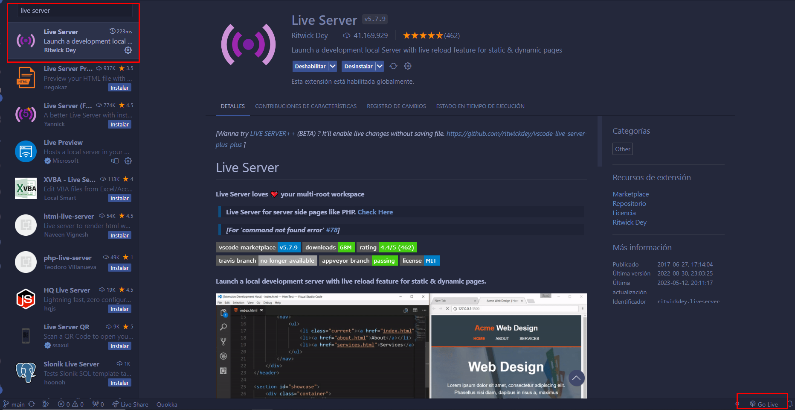

# Weather_App
Sitio web de clima 

Para el desarrollo de este proyecto se utiliza la API "Weather API".

**URL necesarias:**
- https://openweathermap.org/api
**API a consumir**
- https://openweathermap.org/current
**Iconos**
- https://openweathermap.org/weather-conditions

# Lenguajes utilizados
HTML, CSS, JavaScript, Bootstrap 5.

# Levantar servicio o pagina
```
Para iniciar la pagina web y poder visualizar el contenido necesitamos la extencion
"Live Server", una vez descargada esta extención se mostrará en la parte inferior derecha 
un boton / sección llamado "Go Live" para simular un host de forma local mediante Visual Studio Code.
```




